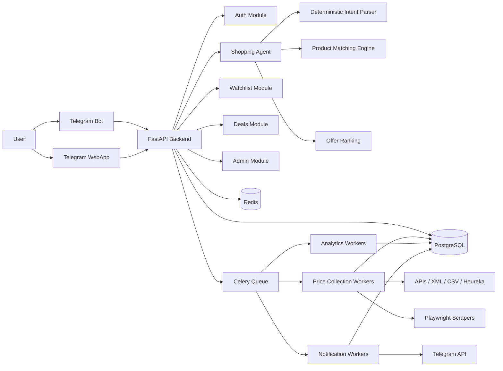
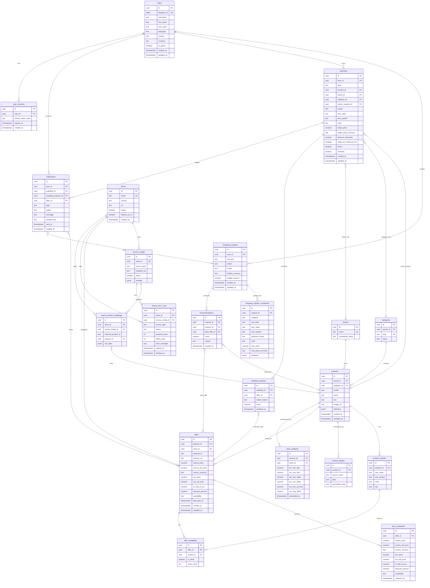

# Kupikupi: Architecture Draft

Status: approval draft  
Scope: architecture, project structure, database model, API contract  
Implementation: not started

## Product Positioning

Kupikupi should be treated as a personal shopping agent, not only as a product monitor.

The user may write a natural-language request:

> Хочу беговые кроссовки для ежедневных тренировок. Размер 41. Бюджет 150 евро.

The service should:

- understand intent, category, constraints, size, budget, country, and delivery needs;
- find suitable products and offers in supported Czech stores;
- normalize product names across stores;
- compare current prices, historical prices, discounts, availability, sizes, and delivery;
- create shortlists or watchlists;
- notify the user when a materially good offer appears.

Watchlists remain part of the domain, but they are an internal/user-facing mechanism of the shopping agent.

## MVP Boundaries

Included:

- Telegram registration and authentication;
- Telegram Bot command flow;
- Telegram WebApp as the main UI;
- natural-language shopping requests;
- deterministic parser for phase 1 shopping request extraction;
- watchlist creation only after explicit user confirmation;
- watchlist management;
- product matching and normalization;
- Czech store integrations;
- price collection in source currency plus normalized EUR values;
- price history;
- price analytics;
- Telegram notifications;
- admin store/source controls;
- Docker Compose deployment;
- tests and migrations for every implementation iteration.

Excluded from MVP:

- automatic purchase;
- in-app payments;
- mobile apps;
- multi-country support;
- AI-based parsing and normalization;
- non-Czech marketplaces.

## High-Level Architecture



## Backend Modules

- `auth`: Telegram login validation, JWT issue/refresh, current user context.
- `users`: profile, settings, notification preferences.
- `shopping_requests`: natural-language request intake, deterministic parsed constraints, generated recommendations.
- `catalog`: products, brands, categories, variants, sizes, colors.
- `stores`: store metadata, source configuration, delivery support, source health.
- `offers`: current store offers, availability, size/color availability, product URLs.
- `prices`: immutable price history, source currency values, normalized EUR values, analytics snapshots.
- `matching`: product normalization, duplicate detection, store-specific mappings.
- `watchlists`: exact product, category, brand, and confirmed agent-created watchlists.
- `deals`: current best deals and ranked recommendations.
- `notifications`: notification events, deduplication, Telegram delivery.
- `admin`: store/source management, manual sync runs, logs.
- `jobs`: Celery tasks for sync, analytics, notification dispatch.

## Data Collection Priority

1. Official APIs.
2. Affiliate XML/CSV feeds.
3. Heureka integration.
4. Playwright scrapers.

Every source adapter should expose the same internal contract:

- fetch catalog/products;
- fetch current offers;
- fetch variants/sizes/colors;
- fetch delivery availability when supported;
- report health and parser errors.

## Suggested Tech Stack

- Backend: FastAPI, Pydantic v2, SQLAlchemy 2.x, Alembic.
- Database: PostgreSQL.
- Cache and locks: Redis.
- Queue: Celery + Redis broker.
- Scraping: Playwright.
- Telegram Bot: aiogram.
- WebApp: Next.js, TypeScript.
- Tests: pytest, pytest-asyncio, httpx, testcontainers or dockerized PostgreSQL.
- CI: lint, typecheck, tests, migration check, Docker build.

## Repository Structure

```text
kupikupi/
  backend/
    app/
      main.py
      api/
        deps.py
        router.py
        v1/
          auth.py
          users.py
          shopping_requests.py
          watchlists.py
          products.py
          offers.py
          deals.py
          price_history.py
          notifications.py
          admin.py
      core/
        config.py
        security.py
        logging.py
        celery_app.py
      db/
        session.py
        base.py
        migrations/
      domains/
        auth/
        users/
        shopping_requests/
        catalog/
        stores/
        offers/
        prices/
        matching/
        watchlists/
        deals/
        notifications/
        admin/
      integrations/
        telegram/
        stores/
          base.py
          footshop.py
          queens.py
          zalando.py
          about_you.py
          sportisimo.py
          notino.py
          dr_max.py
          pilulka.py
          rohlik.py
          kosik.py
        heureka/
      jobs/
        sync_prices.py
        compute_analytics.py
        send_notifications.py
      tests/
        unit/
        integration/
        contract/
    alembic.ini
    pyproject.toml
    Dockerfile

  bot/
    app/
      main.py
      handlers/
        start.py
        watch.py
        list.py
        delete.py
        pause.py
        settings.py
        help.py
      keyboards/
      api_client/
      config.py
    tests/
    pyproject.toml
    Dockerfile

  webapp/
    src/
      app/
      components/
      features/
        dashboard/
        shopping-request/
        watchlists/
        products/
        deals/
        settings/
      lib/
        api.ts
        telegram.ts
      styles/
    tests/
    package.json
    Dockerfile

  packages/
    openapi/
      openapi.yaml
    shared-types/

  infra/
    docker-compose.yml
    docker-compose.test.yml
    nginx/
    scripts/

  docs/
    architecture.md
    deployment.md
    api.md
    development.md

  .github/
    workflows/
      ci.yml
```

## Iterative Implementation Plan

1. Backend foundation:
   FastAPI app, config, PostgreSQL, Alembic, healthcheck, auth skeleton, CI, first tests.

2. Users and Telegram auth:
   Telegram init data validation, JWT, user profile, settings, migrations, API tests.

3. Catalog and stores:
   categories, brands, products, stores, variants, seed data, admin APIs, tests.

4. Shopping requests:
   natural-language request intake, parsed constraints schema, deterministic parser, recommendation draft model, tests.

5. Watchlists:
   exact/category/brand rules, CRUD, archive/pause/delete, creation from shopping request after user confirmation, migrations, tests.

6. Offers and price history:
   offer model, source currency and EUR-normalized prices, price snapshots, analytics tables, price-history API, tests.

7. Source adapters and sync jobs:
   first feed/scraper adapter, Celery sync, source logs, tests with fixtures.

8. Deals and ranking:
   current best offers, historical-low logic, lowest-10-percent logic, tests.

9. Notifications:
   notification rules, deduplication, Telegram dispatch, tests.

10. Telegram Bot:
    `/start`, `/watch`, `/list`, `/delete`, `/pause`, `/settings`, `/help`, backend integration tests.

11. WebApp:
    dashboard, shopping request form, watchlists, product page, deals feed, settings, UI tests.

## ER Diagram



## Key API Resources

- Auth: Telegram login and token refresh.
- Shopping requests: natural-language shopping agent entry point.
- Recommendations: ranked products/offers for a request.
- Watchlists: long-running tracking rules created manually or after request confirmation.
- Products: normalized catalog.
- Offers: store-specific current prices and availability, including source currency and normalized EUR.
- Price history: historical snapshots and analytics.
- Deals: globally or personally relevant offers.
- Notifications: notification history.
- Admin: store/source/sync management.

## Confirmed Product Decisions

- Phase 1 uses a deterministic parser for shopping requests.
- Prices are stored in original source currency and normalized to EUR.
- A shopping request does not automatically create a watchlist; the user must confirm.

## Open Questions Before Implementation

- Which source should be integrated first: affiliate feed, Heureka, or one Playwright scraper?
- Do admins need a WebApp admin area in MVP, or backend endpoints are enough?
